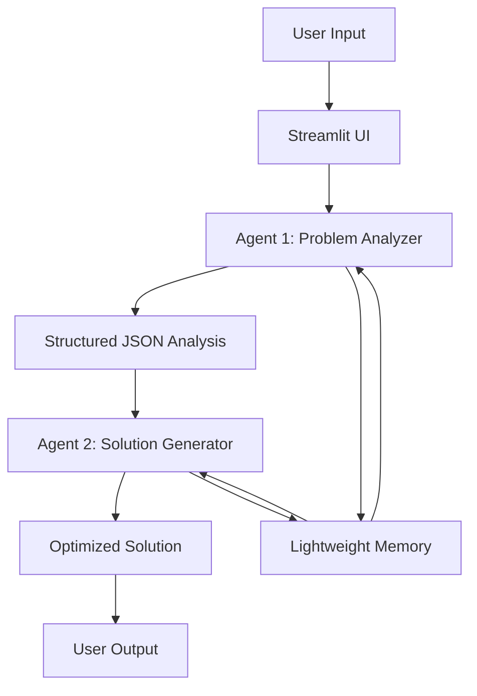

# 🤖 Code Crafter: DSA Problem Solver

[](https://codecrafter4218.streamlit.app/)
[](https://youtu.be/n8twMXZUVkY)

Code Crafter is an intelligent system that combines two AI agents to analyze and solve Data Structures and Algorithms (DSA) problems. Agent 1 (HuggingFace) performs problem analysis, while Agent 2 (OpenAI) generates optimized solutions.


---

## 🌟 Features

- **Dual-Agent Architecture**: Two specialized LLMs working in tandem
- **Structured Problem Analysis**: Extracts input/output formats, constraints, and edge cases
- **Optimized Solutions**: Generates clean, efficient code with complexity analysis
- **Interactive UI**: Streamlit-based interface with sample problems and history
- **Lightweight Memory**: Maintains session context without heavy storage
- **Multi-language Support**: Primarily Python but adaptable to other languages
---

## 🛠️ Tech Stack

### Core Components
| Component | Technology |
|-----------|------------|
| Frontend | Streamlit |
| Agent 1 (Analysis) | HuggingFace (Zephyr-7B) |
| Agent 2 (Solution) | OpenAI (GPT-3.5-turbo) |
| Memory System | Custom lightweight implementation |
| Orchestration | LangChain (LCEL) |

### Supporting Libraries
- Pydantic (for data validation)
- Requests (for API calls)
- Python-dotenv (for environment variables)
---

## 🏗️ System Architecture


---
## Getting Started

### Prerequisites
- Python 3.9+
- OpenAI API key
- HuggingFace API token
- Streamlit

### Installation

1. **Clone the repository**
   ```bash
   git clone https://github.com/sameeran4218/CodeCrafter.git
   cd code-crafter
   ```

2. **Create and activate virtual environment**
   ```bash
   python -m venv venv
   source venv/bin/activate   # On Windows use `venv\Scripts\activate`
   ```

3. **Install dependencies**
   ```bash
   pip install -r requirements.txt
   ```

4. **Set up environment variables**
   ```bash
   echo "OPENAI_API_KEY=your_openai_key" > .env
   echo "HUGGINGFACE_TOKEN=your_hf_token" >> .env
   ```

### Running the Application
```bash
streamlit run app.py
```

---

## 🧠 How It Works

### 1. Problem Analysis Phase (Agent 1)
- Receives natural language problem description
- Extracts structured information including:
  - Problem name
  - Input/output formats
  - Constraints
  - Relevant DSA topics
  - Edge cases
- Outputs a JSON schema for solution generation

### 2. Solution Generation Phase (Agent 2)
- Takes the structured problem analysis as input
- Generates optimized solution code with:
  - Proper comments
  - Time and space complexity analysis
  - Edge case handling
- Maintains context through lightweight memory for better coherence


### 3. User Interface

- **Input Panel:** Paste your problem statement or select from sample problems
- **Analysis View:** Displays structured problem breakdown from Agent 1
- **Solution View:** Shows the generated code with an option to download
- **History:** Keeps track of previous solutions with timestamps

---
